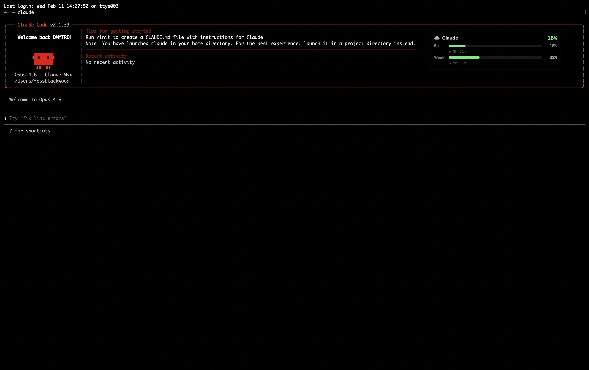

# HowMuchClaude

**Real-time Claude AI usage monitoring for macOS — right on your screen.**

[](https://www.apple.com/macos/)
[](https://swift.org)
[](LICENSE)
[](https://github.com/captainluzik/HowMuchClaude/releases)

HowMuchClaude is a native macOS menu bar app that displays your Claude AI quota usage as a floating, always-on-top overlay. See your 5-hour session limit, weekly limit, and per-model quotas at a glance — without leaving your editor.

<p align="center">
  
</p>

---

## Table of Contents

- [Features](#features)
- [Requirements](#requirements)
- [Installation](#installation)
- [Usage](#usage)
- [Configuration](#configuration)
- [How It Works](#how-it-works)
- [Project Structure](#project-structure)
- [Contributing and Collaboration](#contributing-and-collaboration)
- [License](#license)

---

## Features

### Real-Time Quota Monitoring

- **5-hour session usage** — percentage of your rolling 5-hour quota consumed
- **Weekly usage** — percentage of your 7-day quota consumed
- **Model-specific quotas** — separate Opus and Sonnet weekly breakdowns (expanded mode)
- **Reset timers** — countdown showing when each quota window resets

### Floating Overlay

- **Always visible** — stays on top of all windows across all Spaces
- **Click-through mode** — overlay doesn't interfere with your workflow
- **Compact and expanded views** — minimal bar or detailed breakdown with all quotas
- **Draggable positioning** — move the overlay anywhere on screen (when settings are open)
- **Corner snapping** — preset positions: top-left, top-right, bottom-left, bottom-right

### Customization

- **7 color themes** — Dark, Light, Navy, Forest, Maroon, Slate, Amber
- **5 size presets** — Compact (160px), Small (180px), Medium (220px), Large (280px), Wide (340px)
- **Opacity slider** — adjust transparency from 0% to 100%
- **Configurable refresh interval** — 30 seconds to 5 minutes

### Native and Lightweight

- **Zero external dependencies** — pure Swift with Apple frameworks only
- **No Xcode required** — builds with `swiftc` via command-line tools
- **Launch at Login** — auto-start via SMAppService
- **Menu bar integration** — tray icon with quick access to quotas, settings, and controls

<p align="center">
  
</p>

<p align="center">
  
</p>

---

## Requirements

| Requirement     | Details                                             |
| --------------- | --------------------------------------------------- |
| macOS           | 14.0+ (Sonoma or later)                             |
| Architecture    | Apple Silicon (M1/M2/M3/M4) or Intel                |
| Claude Code CLI | Installed and authenticated at least once           |
| Build tools     | Xcode Command Line Tools (for building from source) |

### Claude Code CLI Setup

HowMuchClaude reads your OAuth credentials created by Claude Code CLI. If you haven't used Claude Code yet:

```bash
# Install Claude Code CLI
npm install -g @anthropic-ai/claude-code

# Run it once to authenticate (this creates the credentials)
claude

# Verify credentials exist
security find-generic-password -s "Claude Code-credentials" -w > /dev/null 2>&1 && echo "OK" || echo "Not found"
```

---

## Installation

### Option 1: Download Release (Recommended)

1. Download the latest `HowMuchClaude.app.zip` from [Releases](https://github.com/captainluzik/HowMuchClaude/releases)
2. Unzip and move `HowMuchClaude.app` to `/Applications/`
3. Remove the quarantine flag (the app is not code-signed):
   ```bash
   xattr -cr /Applications/HowMuchClaude.app
   ```
   Or: right-click the app → **Open** → click **Open** in the dialog
4. A cloud icon appears in your menu bar — the overlay is live

### Option 2: Build from Source

```bash
git clone https://github.com/captainluzik/HowMuchClaude.git
cd HowMuchClaude

# Install command line tools if needed
xcode-select --install

# Build .app bundle
./scripts/build.sh

# Install and launch
cp -r build/HowMuchClaude.app /Applications/
open /Applications/HowMuchClaude.app
```

---

## Usage

### First Launch

1. The overlay appears in the top-left corner showing your current quota percentages
2. A cloud icon appears in the menu bar (top-right of your screen)
3. **Left-click** the cloud icon to open Settings
4. **Right-click** the cloud icon for a context menu with quota summary, refresh, and quit

### Overlay

The overlay shows:

- **Header** — "Claude" label with your 5-hour session percentage
- **Quota bars** — visual progress bars for each quota with reset timers

In **expanded mode**, you also see:

- Subscription type badge
- Per-model weekly quotas (Opus, Sonnet)

### Repositioning

1. Open Settings (left-click the menu bar icon)
2. While Settings is open, drag the overlay anywhere on screen
3. Close Settings — the overlay locks in place
4. Or pick a corner preset from the Position tab

---

## Configuration

Open Settings via the menu bar icon (left-click) or right-click, then Settings.

### Appearance Tab

| Setting     | Options                                               |
| ----------- | ----------------------------------------------------- |
| Size Preset | Compact / Small / Medium / Large / Wide               |
| Color Theme | Dark / Light / Navy / Forest / Maroon / Slate / Amber |
| Opacity     | 0% – 100% (slider)                                    |

### Position Tab

| Setting       | Description                                                       |
| ------------- | ----------------------------------------------------------------- |
| Corner        | Top Left / Top Right / Bottom Left / Bottom Right / Custom (Drag) |
| Always on Top | Keep overlay above all windows                                    |
| Click Through | Mouse events pass through the overlay                             |

### Display Tab

| Setting          | Description                                 |
| ---------------- | ------------------------------------------- |
| Show Quota Bars  | Toggle the progress bars on/off             |
| Refresh Interval | How often to poll the API (30s – 300s)      |
| Launch at Login  | Start automatically when you log into macOS |

### Advanced: UserDefaults

Settings persist in `~/Library/Preferences/com.howmuchclaude.app.plist`:

```bash
# Check current refresh interval
defaults read com.howmuchclaude.app refreshInterval

# Set opacity to 50%
defaults write com.howmuchclaude.app overlayOpacity -float 0.5
```

---

## How It Works

### Architecture

```
┌───────────────────────────────────────────────────────┐
│                   HowMuchClaude.app                   │
│                                                       │
│  ┌─────────────┐   ┌──────────────┐   ┌───────────┐  │
│  │  API Client  │──▶│ StatsManager │──▶│  Overlay  │  │
│  │             │   │              │   │           │  │
│  │ OAuth creds │   │ Aggregation  │   │ NSPanel   │  │
│  │ Token       │   │ Quota data   │   │ SwiftUI   │  │
│  │   refresh   │   │              │   │ views     │  │
│  └─────────────┘   └──────────────┘   └───────────┘  │
│                                                       │
│  ┌─────────────┐   ┌──────────────┐                   │
│  │  Menu Bar   │   │   Settings   │                   │
│  │             │   │              │                   │
│  │ Tray icon   │   │ UserDefaults │                   │
│  │ Context     │   │ SwiftUI      │                   │
│  │   menu      │   │   window     │                   │
│  └─────────────┘   └──────────────┘                   │
│                                                       │
└───────────────────────────────────────────────────────┘
```

### Data Flow

1. **Credential loading** — reads OAuth tokens from macOS Keychain (`Claude Code-credentials` service) or `~/.claude/.credentials.json`
2. **API call** — `GET https://api.anthropic.com/api/oauth/usage` with `anthropic-beta: oauth-2025-04-20` header
3. **Token refresh** — automatically refreshes expired access tokens via `https://platform.claude.com/v1/oauth/token`
4. **Parsing** — extracts `five_hour`, `seven_day`, `seven_day_opus`, `seven_day_sonnet` utilization percentages and `resets_at` timestamps
5. **Display** — SwiftUI views observe `StatsManager` and re-render on data change
6. **Repeat** — timer fires every N seconds (configurable)

### Privacy

- All data stays local — no telemetry, no analytics, no external servers
- The only network calls go to `api.anthropic.com` and `platform.claude.com` (Anthropic's own endpoints)
- OAuth tokens are read from Keychain, never stored separately by this app

---

## Project Structure

```
HowMuchClaude/
├── Sources/
│   ├── App/                        # Entry point, AppDelegate
│   │   ├── HowMuchClaudeApp.swift
│   │   └── AppDelegate.swift
│   ├── Data/                       # API client, credential loading
│   │   ├── ClaudeAPIClient.swift   # OAuth + usage API
│   │   ├── ClaudePathDiscovery.swift
│   │   ├── JSONLParser.swift
│   │   └── Models/
│   │       └── UsageEntry.swift
│   ├── MenuBar/                    # Tray icon, context menu
│   │   └── StatusBarController.swift
│   ├── Overlay/                    # Floating panel + views
│   │   ├── OverlayPanel.swift      # NSPanel with drag support
│   │   ├── CompactOverlayView.swift
│   │   ├── ExpandedOverlayView.swift
│   │   └── OverlayPositionManager.swift
│   ├── Settings/                   # Preferences UI + storage
│   │   ├── SettingsStore.swift
│   │   └── SettingsView.swift
│   └── Stats/                      # Data aggregation
│       ├── StatsManager.swift
│       ├── UsageAggregator.swift
│       └── Models/
│           ├── AggregatedStats.swift
│           └── PricingConfig.swift
├── Resources/
│   ├── Info.plist
│   ├── HowMuchClaude.entitlements
│   └── Assets.xcassets/
│       └── AppIcon.appiconset/     # 16px – 1024px PNGs
├── scripts/
│   └── build.sh                    # Compile + create .app bundle
├── .gitignore
├── README.md
└── LICENSE
```

---

## Contributing and Collaboration

Contributions are welcome. Whether it is a bug fix, a new feature, better documentation, or a design improvement — all of it helps.

### Reporting Bugs

[Open an issue](https://github.com/captainluzik/HowMuchClaude/issues/new) with:

- What happened vs. what you expected
- Steps to reproduce
- macOS version and app version
- Relevant logs from Console.app (filter by `HowMuchClaude`)

### Suggesting Features

[Open a feature request](https://github.com/captainluzik/HowMuchClaude/issues/new) describing:

- The use case — what problem it solves
- Your proposed approach
- Alternatives you considered

### Pull Requests

1. Fork the repo and create a branch from `main`:

   ```bash
   git checkout -b feature/your-feature
   ```

2. Make changes following the code style below

3. Build and test:

   ```bash
   ./scripts/build.sh && open build/HowMuchClaude.app
   ```

4. Push and open a PR against `main`

### Code Style

- Swift 5.9+ with `@MainActor` isolation where appropriate
- Follow [Swift API Design Guidelines](https://swift.org/documentation/api-design-guidelines/)
- Use `async/await` for all asynchronous work
- Prefer composition over inheritance
- Keep functions short and focused
- Type annotations on all public interfaces
- No force unwrapping (`!`) outside of tests

### Areas Where Help Is Needed

| Area          | Description                                      |
| ------------- | ------------------------------------------------ |
| Intel support | Test and fix issues on Intel Macs                |
| Accessibility | VoiceOver support, keyboard navigation           |
| Localization  | Translate the Settings UI                        |
| Themes        | New color presets, custom color picker           |
| Homebrew      | Create a Homebrew Cask formula                   |
| Tests         | Unit and integration test coverage               |
| CI/CD         | GitHub Actions for automated builds and releases |

### Development Setup

```bash
git clone https://github.com/captainluzik/HowMuchClaude.git
cd HowMuchClaude
./scripts/build.sh && open build/HowMuchClaude.app
```

No Xcode project is required. The build script compiles all Swift files with `swiftc` and assembles the `.app` bundle.

---

## License

MIT License. See [LICENSE](LICENSE) for the full text.

---

## Disclaimer

HowMuchClaude is **not affiliated with, endorsed by, or sponsored by Anthropic PBC**. This is an independent, community-driven project. "Claude" and related names are trademarks of Anthropic.

The app reads OAuth credentials created by Claude Code CLI and calls Anthropic's own API endpoints. No data is sent anywhere else. All processing happens locally on your Mac.
